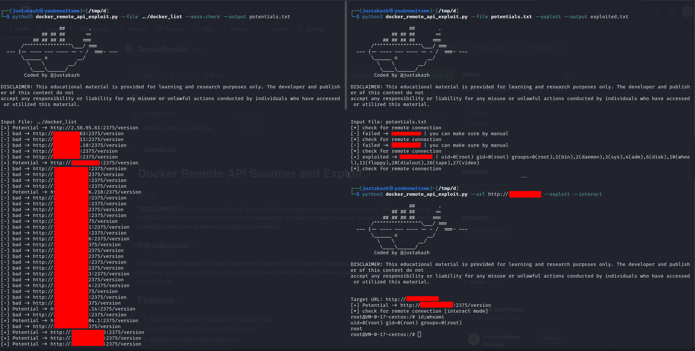

# Docker Remote API Scanner and Exploit



**DISCLAIMER:** This educational material is provided for learning and research purposes only. The developer and publisher of this content do not accept any responsibility or liability for any misuse or unlawful actions conducted by individuals who have accessed or utilized this material.

## Introduction

This repository contains a Docker Remote API Scanner and Exploit tool designed for educational and research purposes. It enables users to perform security assessments and experiments related to Docker container environments.

## Features

- Mass scanning and exploitation of Docker hosts
- Interactive mode for manual interactions
- Specify the target Docker API URL
- Input a list of targets from a file
- Generate output for your scans and exploitation results

## Usage

To get started, you can use the following command-line options:

- `--url URL`: Specify the target Docker API URL.
- `--file FILE`: Specify a file for input, providing a list of target URLs.
- `--output OUTPUT`: Specify a file for output to save the results of your scans and exploitation.
- `--mass-check`: Enable mass scanning and exploitation.
- `--exploit`: Exploit target(s).
- `--interact`: Enter interactive mode for manual interactions.

Single Scan
```bash
python docker_remote_api_exploit.py --url http://127.0.0.1 --output potential.txt
```
Mass Scan
```bash
python docker_remote_api_exploit.py --file targets.txt --mass-check --output potential.txt 
```
Single Exploit
```bash
python docker_remote_api_exploit.py --url http://127.0.0.1 --exploit --output exploited.txt
```
Single Exploit (Interaction Mode)
```bash
python docker_remote_api_exploit.py --url http://127.0.0.1 --exploit --interact --output exploited.txt
```
Mass Exploit
```bash
python docker_remote_api_exploit.py --file potential.txt --exploit --output exploited.txt
```


## Contributing

Contributions are welcome! Feel free to create issues, propose new features, or submit pull requests to improve this tool. Please ensure that your contributions align with the intended use of this repository.

## License

This tool is available under the [MIT License](LICENSE). Please review the license before using or contributing to this project.

## Disclaimer

By using this tool, you acknowledge and agree to the terms and conditions outlined in the DISCLAIMER section above.

## Author

- Coded by [@justakazh](https://github.com/justakazh)

---

For educational and research purposes only. Use responsibly and ethically.

